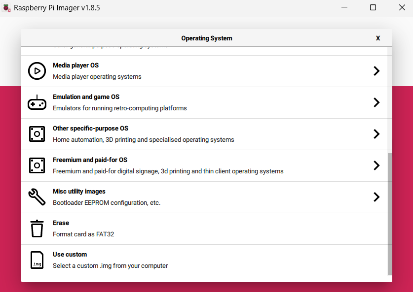
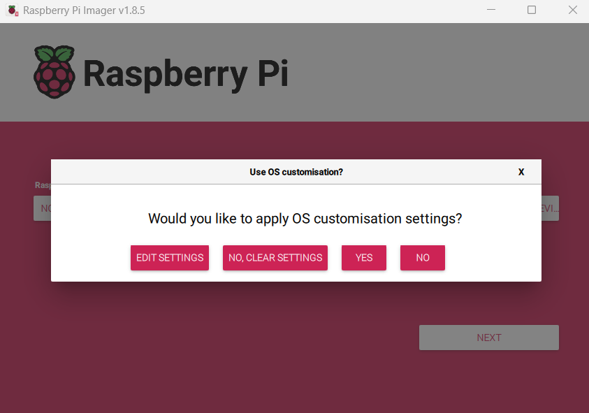
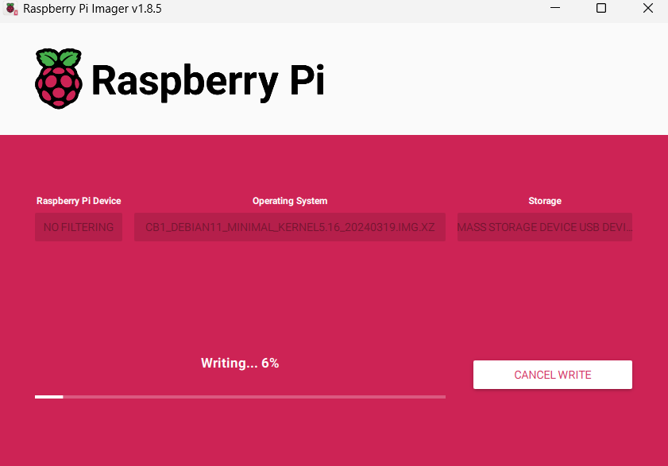
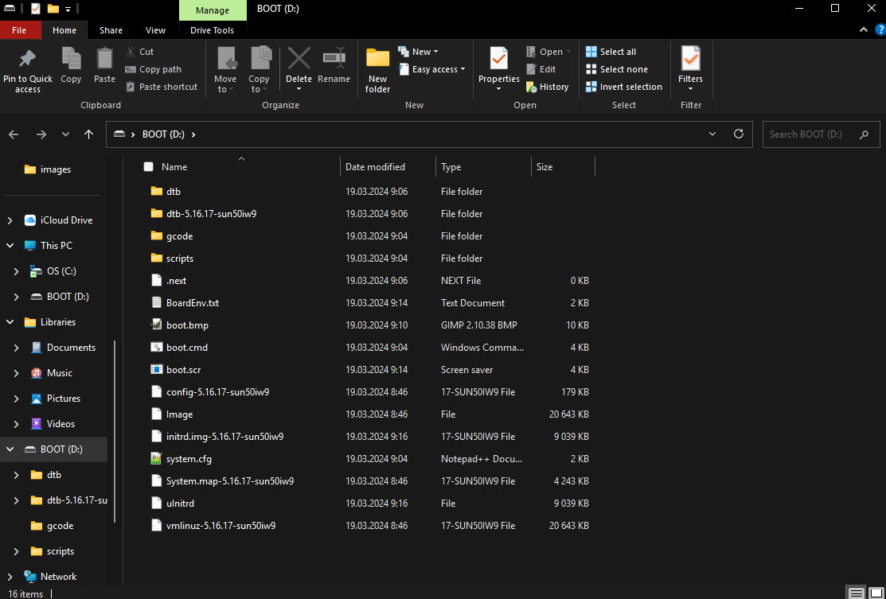
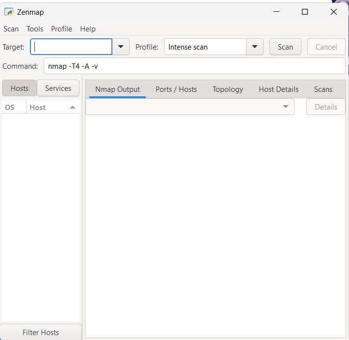
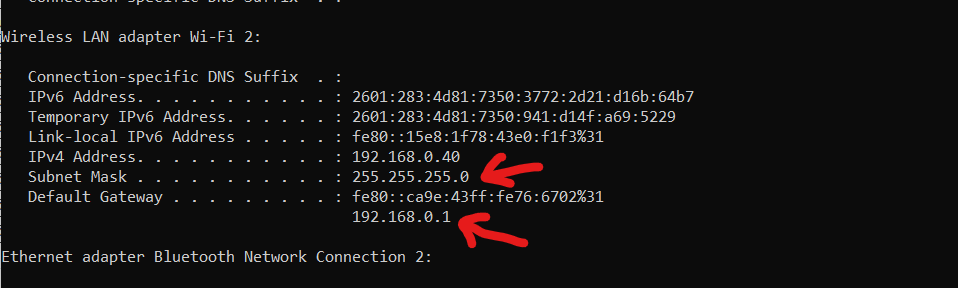
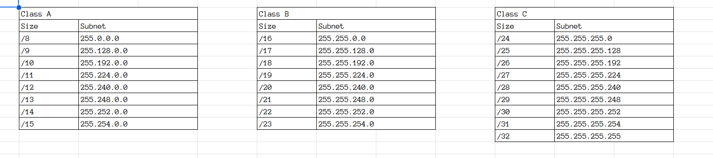
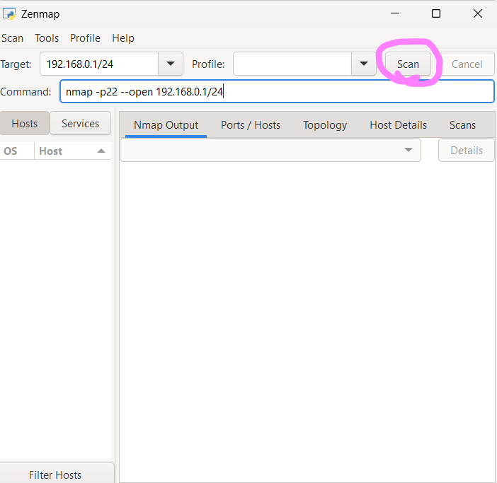
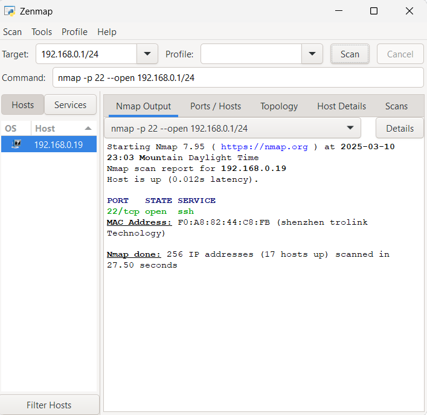
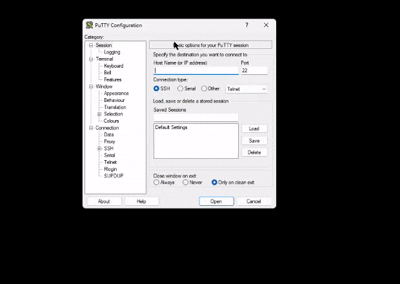

The CB1 and the Pi1 are pretty much the same thing, so they use all the same software. And since it's not a raspberry pi chip, you'll have to use the images provided by BTT.

For this guide, you'll need about 1GB of free space on your computer c:

# Image
## Pi Imager
First, you'll need to download Raspberry Pi imager from [here](https://github.com/raspberrypi/rpi-imager/releases). The screenshots in this guide are of v1.8.5 but other versions shouldn't be too different. Download and install it.

## BTT Image
Now the actual image.

BTT released the v3.0.0 image that uses debian 12, but get the V2.4.3. I've fully tested it and I know that it works wihtout issues.

*Download the `CB1_Debian11_minimal_kernel5.16_20240319.img.xz`, theres no use for the klipper version, it only brings more potential problems.*

[Here's the download page.](https://github.com/bigtreetech/CB1/releases/tag/V2.3.4) Save it somewhere you'll be able to access.

## Write
Grab an SD card that's atleast 8GB, and plug it into your device. (Windows is preferred but Mac and Linux work too). It is also recommended to unplug other external storage devices from your computer to reduce confusion.

Now open the Pi Imager.

Under "Device" select "No Filtering" and under "Storage" select your SD card.

For "Operating System" scroll down, and click "Use Custom". It will open a file explorer window and you'll need to pick the image that you downloaded earlier.



Click "Write" and if it prompts to change settings, select "No".



Click yes to continue.



When it finishes writing, unplug the SD card and plug it back in, just to make sure it reads correctly.
## Configure settings
### WiFi
If you're using ethernet, skip this section and go to "Overlays"

Go to file explorer and click on the SD card. There should be a file named `system.cfg`. Edit it in a notepad or any other supported editor.



Under the Wifi section, find the wifi name and password settings. Set your WiFi name and password. It should be something like this:
```
# wifi_name
WIFI_SSID="SuzukiWifi"
# wifi password
WIFI_PASSWD="SuzukiWifiPass"
```
__________________________________________________________
### Overlays
Really the only one that's important for us is the tft display, since a lot of people would be using that.

i2c doesn't work on these (because BTT), spi isnt really needed if you're not using it, and everything else is some specific thing that one in a million people uses. c:

To change overlays, go to `BoardEnv.txt`, and uncomment what you need.

For a TFT display, uncomment `overlays=tft35_spi`, don't forget to save and restart.
# First boot
Plug the SD card into the Pi or CB1. For CB1 make sure it's the right slot. You can now power on the Pi/CB1.

When it boots, you'll need to find it's IP address. This can be done multiple ways:
1. (Works most times) Use an IP scanner to find it.
2. (Depends on your router) Go to the router terminal and find it through attached devices.

Everything else can be considered a mental disability :3

## IP Scanner
We'll be using Zenmap for the scanner, it's a bit on the more complicated side but it also has the most features. It also has a version for all operating systems c:

Download from [here](https://nmap.org/download.html). Keep all of the default settings.

Here's how the main menu should look:



Now you'll need to open command prompt and find your router info, to do that open command prompt (if windows), or terminal (if on mac). Linux people already know what to do.

Get the subnet mask and the default gateway on windows:



My subnet is `255.255.255.0` and gateway is `192.168.0.1`. This is what I'll be using for my examples.

Now, you'll need to look at this able and find out your network range:



For my subnet of 255.255.255.0 the network range is /24. The slash is important!

Now go back to zenmap and put this into the command line:
```
nmap -p22 --open <gateway><range>
```
So for example I'll put `nmap -p22 --open 192.168.0.1/24`.

Then click scan.



It could take a while to scan depending on your network range and the amount of devices you have.

When it finishes, it should spit out some informations about a device:



The most important part here is the `192.168.0.19`, that's the IP address of your CB1/Pi. Copy it somehere safe. And you can now close zenmap.

*If multiple devices show up, you'll have to try and error your way to finding it*

## SSH
Now the fun part, getting into the CB1/Pi.

For this, you'll need to download PuTTY if you're on windows. If you're on mac, you can do it through terminal. Linux users can figure out OpenSSH by themselves, I'm too stupid for that anyway c:

Download PuTTY from [here](https://www.chiark.greenend.org.uk/~sgtatham/putty/latest.html). Most will need the 64-bit x86 .msi. Install it with all default settings.

Paste the IP address we got earlier into the terminal and click open:

It'll ask for the user, if you used the v2.4.3 image, both the user and the password will be "biqu", when you type the password it's not going to show up.



The SSH terminal should open.